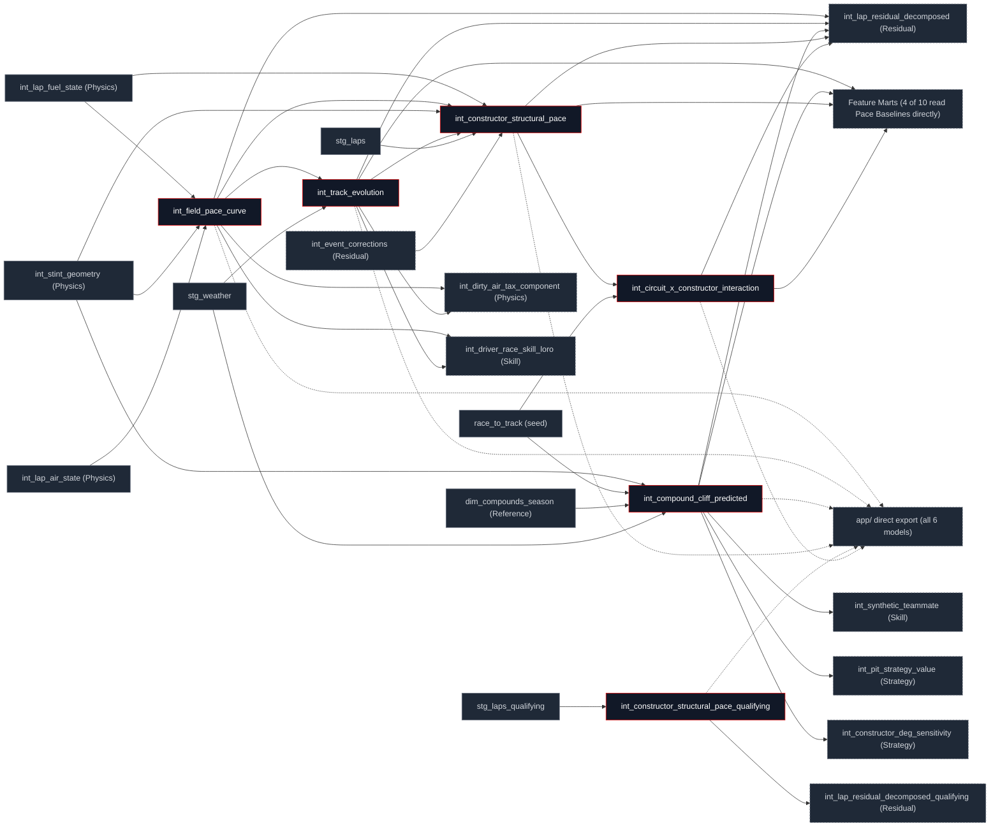

## What this family does

Pace Baselines builds the reference surfaces every later family measures a lap against: the trimmed-mean field pace curve, its rubber/ambient decomposition, the compound degradation trajectory, and constructor structural pace (race and qualifying) plus its circuit-specific interaction term. All six are materialized as tables rather than views each is read many times downstream, by several different families, so computing it once and storing it beats recomputing a window function on every read.

Pace Baselines' upstream is staging plus Physics' fuel/stint/air-state plus one Reference dim (`dim_compounds_season`) it is the first family to combine raw laps and physics state into something with race-wide structure. Downstream, every model in this family feeds at least one of Physics (the dirty-air cycle-avoidance read), Skill, Residual Decomposition, Strategy, or the feature marts directly no model here is purely an internal stepping stone. Independently of the DAG, **all six are also exported straight to `app/public/data/intermediates/`** by `scripts/export_app_data.py`, several powering a named app feature with no marts model in between: `int_field_pace_curve` → Field Pace Curve, `int_track_evolution` → Track Evolution, `int_constructor_structural_pace` → Constructor Structural Pace, `int_circuit_x_constructor_interaction` → Constructor × Circuit Interaction. Both paths run simultaneously, not as alternatives a model already consumed by five other dbt models is exported raw all the same.

## The sub-DAG



`Marts` collapses four distinct mart edges (`fct_cliff_prediction_features`, `fct_ghost_car_pace`, `fct_driver_skill_features`, `mart_corner_skill_driver`) into one node this family's one deliberate sub-DAG simplification, flagged per the same convention `families/staging` used for `stg_laps`' wider fan-out. Every other edge in this diagram names its endpoint individually. Only two of the six models read staging directly (`int_constructor_structural_pace` via `stg_laps`, the qualifying variant via `stg_laps_qualifying`); the rest reach raw laps only transitively, through Physics.

## How it works

Three distinct identification problems share this family. The field curve and its rubber/ambient split are the representative pattern: a robust statistic computed once in SQL, no fitting step. `int_field_pace_curve` trims the top and bottom 10% of the field at each lap number before averaging, then smooths with a 5-lap centred window:

```sql
PERCENT_RANK() OVER (
    PARTITION BY race_year, race_id, lap_number
    ORDER BY weight_corrected_lap_time
) AS pct_rank
-- ...
AVG(weight_corrected_lap_time) FILTER (WHERE pct_rank BETWEEN 0.10 AND 0.90)
    AS field_pace_trimmed_mean_s
-- ...
AVG(field_pace_trimmed_mean_s) OVER (
    PARTITION BY race_year, race_id
    ORDER BY lap_number
    ROWS BETWEEN 2 PRECEDING AND 2 FOLLOWING
) AS field_pace_smoothed_s
```

`int_track_evolution` then splits that curve's drift into a rubber component and an ambient component, identified by a structural asymmetry: rubber-in only ever improves grip, so its slope is forced monotone-decreasing in pace, while ambient temperature can move either direction (see [The Estimation Order](/decomposition/methodology) for the full identification argument). The clamp is a hard `LEAST(..., 0.0)`, not a soft prior:

```sql
LEAST(
    SUM((c.lap_number - rm.mean_lap) * (c.field_pace_smoothed_s - rm.mean_pace))
    / NULLIF(SUM(POWER(c.lap_number - rm.mean_lap, 2)), 0),
    0.0
) AS rubber_slope_s_per_lap
```

`int_compound_cliff_predicted` predicts expected pace from a hockey-stick polynomial in tyre age $a$, with a hinge term that only activates once a lap passes the fitted cliff onset $a_{\text{onset}}$ (from `dim_compounds_season`):

$$\text{pace}(a) = \beta_0 + \beta_1 a + \beta_2 a^2 + \beta_3 \max(0,\, a - a_{\text{onset}})^2$$

The constructor-pace half (`int_constructor_structural_pace` and its two dependents) takes a third approach entirely: re-centred grouped statistics rather than a curve fit. Its own header calls this a placeholder for a full panel regression covered in Design Notes, since that's a genuine, verified gap between what the model does today and what its `schema.yml` description claims.

## Design notes

<Tabs>
  <Tab title="Why this shape">
    The trimmed mean needs no fitting step and is cheap to recompute per lap number; it breaks only if more than 40% of the field is simultaneously off-pace, which [`assert_field_pace_honest_range`](/transform/ci/domain-constraints) holds to a ±5s band against the race median as a standing guarantee. The rubber/ambient split's hard monotonicity clamp is the same identification argument as `decomposition/methodology`'s estimation order, implemented as a SQL constraint rather than left as a property the fitted slope merely tends to have [`assert_track_evolution_monotone`](/transform/ci/domain-constraints) checks it holds on every build.

    **A real, verified gap, not a documentation typo**: `int_constructor_structural_pace.sql`'s own header describes its current grouped-percentile approach as "a placeholder for the full panel regression spec (pyfixest HDFE fit)" and names the intended replacement directly `feols` with CRV1 clustering by `race_id, constructor_id`. The model's `schema.yml` description, by contrast, already claims it "uses high-dimensional fixed effects" that line is aspirational, not current behaviour; this page describes what the SQL actually computes (median pace delta, re-centred by the race-average constructor), not the schema description. The HDFE replacement the header names already exists, but as a new, separate model in the Skill family (`int_constructor_car_fe`) rather than as a rewrite of this one `int_constructor_structural_pace` has 10+ consumers including the calibration-gated ghost-pace marts that must stay byte-identical, so swapping its estimator in place was a bigger blast radius than adding the FE model alongside it. See [Skill](/transform/families/skill) for that model.

    `int_constructor_structural_pace`'s clean-lap filter reads `int_event_corrections` and `int_track_evolution`'s rainfall flag instead of `int_lap_anomaly_flags` the same cycle-avoidance reasoning [Physics](/transform/families/physics) documents for `int_dirty_air_tax_component`: `int_lap_anomaly_flags` depends on `int_lap_residual_decomposed`, which depends on this model, so reading it directly would close a loop.
  </Tab>
  <Tab title="Other approaches">
    A fully robust M-estimator (Huber loss) is the credible alternative to the 10%-trimmed mean; at F1 field sizes (~20 cars) the extra robustness buys little over a trim, for materially more SQL.

    The rubber/ambient split is an in-SQL linear approximation by design the model's own header flags a full LOWESS fit as the credible alternative, with the same fit-then-seed shape [Reference](/transform/families/reference)'s compound-cliff fitter already uses. The linear form captures most of the rubber effect with zero non-deterministic steps inside `dbt run`; a LOWESS fit would need the same offline-fit-and-promote governance the cliff coefficients already get.

    Replacing `int_constructor_structural_pace`'s grouped aggregation with the full HDFE panel regression its header names would mean re-deriving the byte-stability baseline for every mart downstream of it (`fct_ghost_car_pace`, `fct_ghost_race_finish`); the narrower path actually taken a new, separately-scoped FE model for the one consumer that needed de-biased car pace avoided that.

    A continuous quadratic-only compound trajectory (no hinge) is the credible alternative to the hockey-stick: smoother to differentiate and extrapolate, but it cannot represent a sudden onset of grip loss as sharply as the hinge term does.
  </Tab>
</Tabs>

## Every model in this family

<CardGroup cols={3}>
  <Card title="int_field_pace_curve" icon="gauge" href="/reference/models/int/int_field_pace_curve">
    Trimmed-mean (10%) field pace per lap, smoothed over a 5-lap centred window the curve every later pace delta is measured against.
  </Card>
  <Card title="int_track_evolution" icon="thermometer" href="/reference/models/int/int_track_evolution">
    Splits the field-pace curve into a monotone rubber component and a temperature-correlated ambient component.
  </Card>
  <Card title="int_compound_cliff_predicted" icon="trending-down" href="/reference/models/int/int_compound_cliff_predicted">
    Hockey-stick expected-pace and degradation-rate prediction per lap, from fitted per-(circuit, compound, season) cliff coefficients.
  </Card>
  <Card title="int_constructor_structural_pace" icon="car" href="/reference/models/int/int_constructor_structural_pace">
    Race-grain constructor car-pace via re-centred median pace delta a verified placeholder for the full HDFE panel regression its own header names.
  </Card>
  <Card title="int_constructor_structural_pace_qualifying" icon="timer" href="/reference/models/int/int_constructor_structural_pace_qualifying">
    The same re-centred-median approach, fit on one-lap qualifying pace instead of race pace.
  </Card>
  <Card title="int_circuit_x_constructor_interaction" icon="map" href="/reference/models/int/int_circuit_x_constructor_interaction">
    Circuit-specific constructor bonus/penalty beyond the season average, shrunk toward zero with a weak prior.
  </Card>
</CardGroup>
