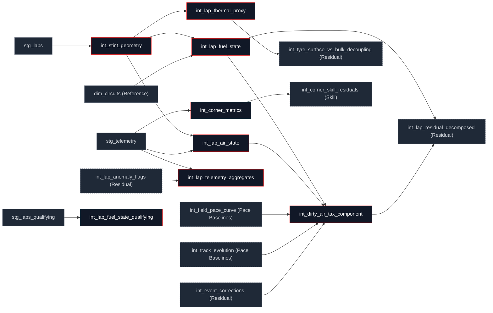

## What this family does

Physics turns each valid lap into a vector of physical state: fuel mass remaining, cumulative push load on the tyre (a thermal proxy), air-state classification and dirty-air exposure, and per-corner speed/g metrics. Every model in this family partitions its window functions on `stint_id`, the identifier `int_stint_geometry` builds first so a pit stop resets every trailing computation cleanly. Two of the eight components are purely deterministic arithmetic (fuel burns off at a fixed rate; nothing is fitted); the rest are finite, backward-looking weighted sums no model in this family ever reads ahead of the current lap.

Physics's primary upstream is staging (`stg_laps`, `stg_telemetry`, `stg_laps_qualifying`) plus `dim_circuits` from Reference for per-circuit constants. One model, `int_dirty_air_tax_component`, also reads forward from Pace Baselines (`int_field_pace_curve`, `int_track_evolution`) and Residual Decomposition (`int_event_corrections`) a deliberate exception covered below. Physics's downstream is Pace Baselines and Residual Decomposition, which consume these components as additive terms in the seven-term identity.

## The sub-DAG



## How it works

The fuel term is the family's only fully deterministic component: nothing is fitted, only burned off at a fixed per-circuit rate.

$$m_{\text{fuel}}(t) = \max\!\big(m_0 - r\,(t-1),\; 0\big)$$

```sql
GREATEST(
    initial_fuel_kg - fuel_consumption_rate_kg_per_lap * (lap_number - 1),
    0.0
) AS fuel_mass_kg
```

The thermal-push term is the representative EMA-style component: a finite, backward-only weighted sum of positive push residuals (only pushing harder than the stint baseline contributes load; coasting doesn't), partitioned on `stint_id` so a pit stop zeroes it. Two time constants run side by side a short one for immediate surface grip, a longer one for the load that drives the end-of-stint cliff:

```sql
-- Surface load (τ≈3 laps): 5-lap lookback, only positive residuals
GREATEST(push_residual, 0)
+ 0.717 * GREATEST(COALESCE(LAG(push_residual, 1) OVER w, 0), 0)
+ 0.514 * GREATEST(COALESCE(LAG(push_residual, 2) OVER w, 0), 0)
+ 0.369 * GREATEST(COALESCE(LAG(push_residual, 3) OVER w, 0), 0)
+ 0.264 * GREATEST(COALESCE(LAG(push_residual, 4) OVER w, 0), 0)
    AS cumulative_push_load_surface
```

The boundary every one of these window functions resets on is built once, in `int_stint_geometry`, the family's foundation model:

```sql
CONCAT(race_year, '_', race_id, '_', driver_id, '_', stint_number) AS stint_id,
ROW_NUMBER() OVER (
    PARTITION BY race_year, race_id, driver_id, stint_number
    ORDER BY lap_number
) AS lap_in_stint
```

## Design notes

<Tabs>
  <Tab title="Why this shape">
    Fuel is deterministic because it can be: mass burned is arithmetic, not a quantity that needs fitting from data. The one fitted number in the fuel term, the per-kilogram weight penalty, lives in `dim_circuits` (Reference), not here keeping it out of this family means re-fitting that coefficient never touches physics SQL.

    Push load, air state, and the telemetry cliff signals all use finite backward-only lookback windows rather than an unbounded recursive EMA, because DuckDB window functions can express a fixed `LAG` sum without a recursive CTE, and a finite window is trivially provable to never read a future lap a property [`assert_no_future_leakage`](/transform/ci/domain-constraints) enforces directly on `int_lap_thermal_proxy`, and [`assert_stint_boundary_integrity`](/transform/ci/domain-constraints) confirms resets cleanly at every stop for fuel, thermal, and air state together.

    `int_dirty_air_tax_component` is the one model in this family that reads forward, into Pace Baselines and Residual Decomposition and it does so by design, to avoid a cycle. The natural clean-lap filter would be `int_lap_anomaly_flags`, but that model itself depends on `int_lap_residual_decomposed`, which depends on `int_dirty_air_tax_component` reading it directly would create `int_dirty_air_tax_component → int_lap_anomaly_flags → int_lap_residual_decomposed → int_dirty_air_tax_component`. The model reads `int_event_corrections`' `correction_weight` instead, a model that resolves the same "is this lap clean" question without the cycle.
  </Tab>
  <Tab title="Other approaches">
    `int_lap_telemetry_aggregates`' five cliff-drift features are computed lap-internally (within-lap speed minima, brake-onset events) rather than joined against the circuit corner catalogue (`dim_corners`). The catalogue resolves for 34 of the 36 event slugs since it was derived from FastF1 corner geometry, so this is no longer a coverage argument: the lap-internal formulation trades named-corner specificity for a feature that needs no corner mapping at all, with missingness left explicit for the gradient-boosted model that reads it downstream rather than backfilled.

    A continuous wake-intensity metric (treating dirty air as a smooth function of following distance) is a credible alternative to `int_lap_air_state`'s discrete per-sector classification (`free_air` / `tow_zone` / `drs_train` / `dirty_air`). The discrete classes are simpler to validate against accepted-value tests and to reason about per sector; a continuous metric would need its own calibration step rather than reusing the existing classification's downstream consumers as-is.
  </Tab>
</Tabs>

## Every model in this family

<CardGroup cols={3}>
  <Card title="int_stint_geometry" icon="ruler" href="/reference/models/int/int_stint_geometry">
    The family's foundation: builds stint_id and lap_in_stint, the partition key every other physics window uses.
  </Card>
  <Card title="int_lap_fuel_state" icon="fuel" href="/reference/models/int/int_lap_fuel_state">
    Deterministic fuel-mass burnoff and the weight-penalty correction to lap time.
  </Card>
  <Card title="int_lap_fuel_state_qualifying" icon="fuel" href="/reference/models/int/int_lap_fuel_state_qualifying">
    Flat fuel-load assumption for qualifying laps, on the same grain as the race-side model.
  </Card>
  <Card title="int_lap_air_state" icon="wind" href="/reference/models/int/int_lap_air_state">
    Per-sector air-state classification and EW-accumulated thermal load from dirty air.
  </Card>
  <Card title="int_lap_thermal_proxy" icon="thermometer" href="/reference/models/int/int_lap_thermal_proxy">
    Cumulative push load on the tyre from a finite backward-weighted sum of positive pace residuals.
  </Card>
  <Card title="int_corner_metrics" icon="locate-fixed" href="/reference/models/int/int_corner_metrics">
    Per-corner speed and g-force aggregated from 10 Hz telemetry.
  </Card>
  <Card title="int_lap_telemetry_aggregates" icon="activity" href="/reference/models/int/int_lap_telemetry_aggregates">
    Powertrain aggregates plus five within-stint telemetry-drift cliff signals, computed lap-internally.
  </Card>
  <Card title="int_dirty_air_tax_component" icon="cloud-fog" href="/reference/models/int/int_dirty_air_tax_component">
    Per-second cost of running in another car's wake, identified from lagged dirty-air share to avoid a dependency cycle.
  </Card>
</CardGroup>
