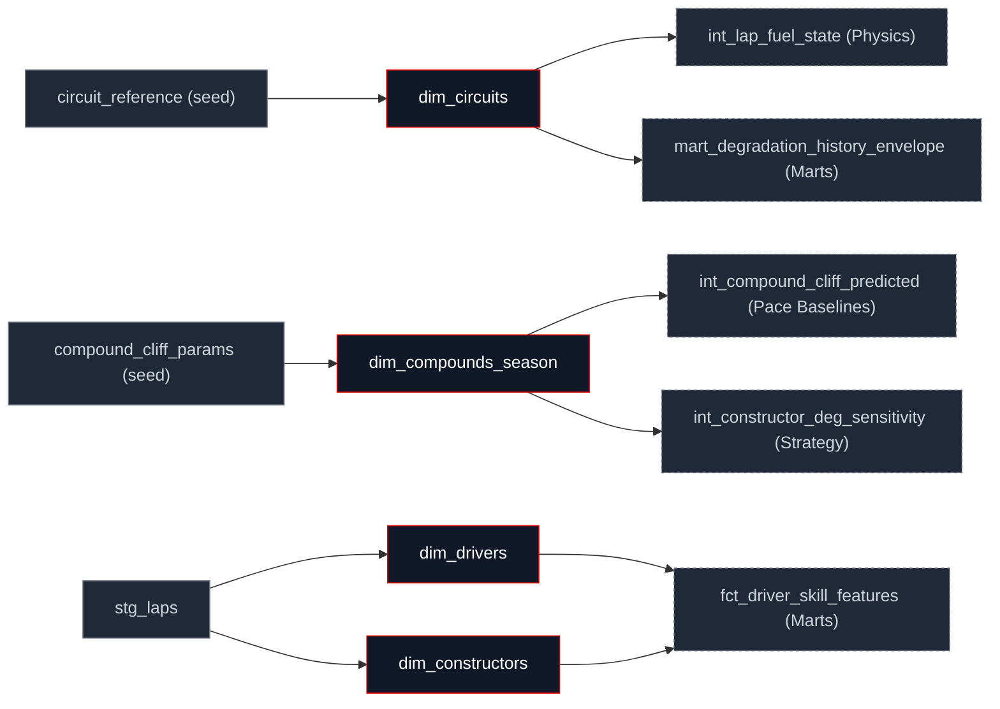

## What this family does

Reference is four small dimension tables, all materialized as DuckDB tables rather than views, because every one of them is a slowly-changing lookup rather than a lap-grain fact. The family splits cleanly in two: `dim_circuits` and `dim_compounds_season` lift fitted physics constants from committed CSV seeds per-circuit weight-penalty factor and abrasiveness, per-(circuit, compound, season) Kaplan-Meier cliff onset and severity while `dim_drivers` and `dim_constructors` derive their rows live from `stg_laps` on every `dbt run`, with no seed involved.

Reference's upstream is therefore split: two seeds (`circuit_reference`, `compound_cliff_params`) and one staging model (`stg_laps`, read twice, independently, by the two laps-derived dims). Its downstream is the physics and pace-baselines families, which join these dims onto lap-grain models to attach physics constants, plus the feature marts, which join driver and constructor identity directly.

## The sub-DAG



## How it works

`dim_compounds_season` is the representative seed-lift: cast every column from the seed, no joins, no business logic the model's entire job is giving the seed a stable type contract.

```sql
SELECT
    CAST(circuit_key AS VARCHAR) AS circuit_key,
    CAST(compound_code AS VARCHAR) AS compound_code,
    CAST(season AS INTEGER) AS season,
    CAST(compound_cliff_onset_laps AS DOUBLE) AS compound_cliff_onset_laps,
    CAST(compound_cliff_severity AS DOUBLE) AS compound_cliff_severity,
    CAST(fit_date AS DATE) AS fit_date,
    CAST(data_window AS VARCHAR) AS data_window
FROM {{ ref('compound_cliff_params') }}
```

`dim_circuits` does one thing beyond the cast: it derives a stable `circuit_id` from the circuit's display name, because the seed's own key (`circuit_key`) is really a grand-prix/event slug a single physical venue can carry several keys across renamed events and double-headers (Silverstone hosts both `british_grand_prix` and `70th_anniversary_grand_prix`).

```sql
CAST({{ circuit_id_from_name('circuit_name') }} AS VARCHAR) AS circuit_id
```

<Steps>
  <Step title="Fit">
    `tasks/coefficients/fit_compound_cliff.py` reads the built warehouse and runs a Kaplan-Meier survival fit per (circuit, compound, season); `fit_weight_penalty.py` regresses the per-circuit weight-penalty factor.
  </Step>
  <Step title="Write">
    The fitter writes a candidate CSV to the seed path no model reads it yet.
  </Step>
  <Step title="Promote">
    `make coefficients-promote` reviews and commits the candidate as the new `seeds/compound_cliff_params.csv` (or `circuit_reference.csv`).
  </Step>
  <Step title="Rebuild">
    The next `dbt seed && dbt run` lifts the promoted seed into `dim_compounds_season` (or `dim_circuits`) as a table, and everything downstream reads the new constants.
  </Step>
</Steps>

## Design notes

<Tabs>
  <Tab title="Why this shape">
    The seed-backed half exists because a Kaplan-Meier survival fit needs the whole built warehouse as input and is expensive and slow-changing it only needs re-running when a new season is ingested, not on every `dbt run`. Snapshotting the fitted output as a committed CSV keeps `dbt run` pure SQL, deterministic, and fast; the fit itself runs offline and its output is reviewed before promotion, the same governance a hand-edited reference table would get.

    The laps-derived half exists because driver and constructor identity is cheap to derive and changes whenever new data is ingested a seed for "which drivers exist" would go stale the moment a new race lands, where deriving it from `stg_laps` on every build means it never can. `dim_constructors`' power-unit-family mapping is the one piece of business knowledge in this half, and it's a hand-maintained `VALUES` list inline in the model rather than a third seed mapping a customer-engine relationship is rare enough to change that the promote ceremony a real seed would need is more process than the update frequency justifies.
  </Tab>
  <Tab title="Other approaches">
    Re-fitting the survival model on every `dbt run` instead of seed-and-promote would mean every CI run depends on a Python/sklearn fit with its own sampling variance, inside the blast radius of the byte-stability oracle (Regression Gates) that everything else in this layer is held to. The current split keeps the non-deterministic step outside `dbt run` entirely.

    Seeding the PU-family mapping the way `compound_cliff_params` is seeded would give it the same promote-and-review ceremony as a fitted coefficient, for a fact that changes on the order of once a season a credible choice if the mapping grows large enough that an inline `VALUES` list becomes unwieldy to review in a diff.
  </Tab>
</Tabs>

## Every model in this family

<CardGroup cols={3}>
  <Card title="dim_circuits" icon="map-pin" href="/reference/models/dim/dim_circuits">
    Per-circuit physics constants from the circuit_reference seed: lap length, corner count, lateral-g, weight-penalty factor.
  </Card>
  <Card title="dim_compounds_season" icon="circle-dot" href="/reference/models/dim/dim_compounds_season">
    Per-(circuit, compound, season) Kaplan-Meier cliff parameters from the compound_cliff_params seed.
  </Card>
  <Card title="dim_drivers" icon="user" href="/reference/models/dim/dim_drivers">
    Driver identity derived from stg_laps: FastF1 code, debut year, career races in the dataset.
  </Card>
  <Card title="dim_constructors" icon="users" href="/reference/models/dim/dim_constructors">
    Constructor identity derived from stg_laps, with a hand-maintained power-unit-family mapping.
  </Card>
</CardGroup>
