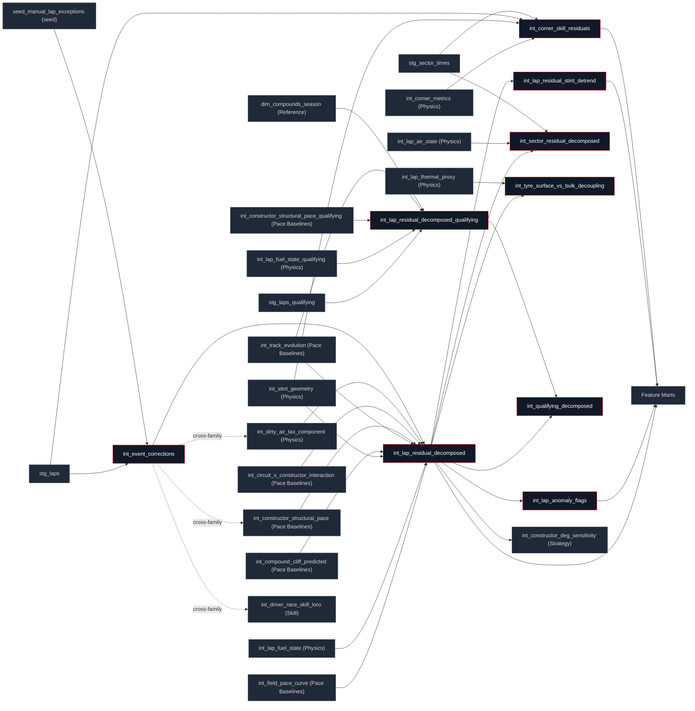

## What this family does

Residual Decomposition computes the [seven-term identity](/decomposition/seven-term-identity): it subtracts six physics and car terms from each lap's deviation from field pace, and whatever is left over is `driver_skill_residual_s` by definition, not by a separate fit. One model (`int_lap_residual_decomposed`) does the actual closure; the other eight either refine its grain (sector, corner), mirror it for qualifying, or run a diagnostic on the closed residual it produces.

Upstream is Pace Baselines and Physics, which supply five of the seven terms (`int_field_pace_curve`, `int_constructor_structural_pace`, `int_compound_cliff_predicted`, `int_track_evolution`, `int_dirty_air_tax_component`, `int_lap_fuel_state`) confirmed against `manifest.json`, not assumed from a "physics + baselines" summary, which undercounts the parent set. This family also has its own root input, `int_event_corrections`, which is *not* itself a closure term: it classifies every lap (SC, VSC, restart, yellow, pit, outlier, manual override) and computes a `correction_weight`, carried as metadata through `int_lap_residual_decomposed` but **not applied there** the model deliberately leaves every lap's residual in the output, full of contaminated laps, so each downstream consumer can choose its own masking policy rather than inherit one baked in upstream (see Design Notes). Downstream is Marts (`fct_lap_residuals`, `fct_driver_skill_features`, `fct_cliff_prediction_features`, `fct_stint_features`, `fct_ghost_car_pace`, `mart_degradation_history_envelope`) and, for the deg-sensitivity model, Strategy.

**`int_event_corrections` itself fans out well beyond this family** a real cross-family read, verified directly against `manifest.json`'s child map, not inferred: it's also read by `int_constructor_structural_pace` (Pace Baselines), `int_dirty_air_tax_component` (Physics), and `int_driver_race_skill_loro` (Skill). Those three use it the same way `int_lap_residual_decomposed` does to exclude or down-weight SC/VSC/outlier laps from their own fits rather than waiting for the closure model to finish. This means Residual Decomposition is not a purely downstream family for lap-event classification the way a simple upstream/downstream summary would imply; `int_event_corrections` is closer in role to a shared staging utility that happens to be tagged `residual` because the correction taxonomy it owns is residual-decomposition's own concept. [Physics](/transform/families/physics) already documents the mirror image of this: `int_dirty_air_tax_component` reads `int_event_corrections` instead of this family's `int_lap_anomaly_flags`, specifically to avoid a dependency cycle (`int_dirty_air_tax_component → int_lap_anomaly_flags → int_lap_residual_decomposed → int_dirty_air_tax_component`).

## The sub-DAG



Four of the nine models also export straight to the app via `scripts/export_app_data.py`, confirmed against the app's own query files (not just the export script's table list): `int_qualifying_decomposed` → Quali-vs-Race Skill, `int_tyre_surface_vs_bulk_decoupling` → Tyre Recovery Forecast, `int_sector_residual_decomposed` → Sector Decomposition, `int_lap_anomaly_flags` → Data Quality Audit. A fifth model, `int_corner_skill_residuals`, is also exported to `app/public/data/intermediates/` but verified by grepping every `app/src/features/*/queries.ts` and finding no reference currently has no app consumer; the only thing reading it today is the `mart_corner_skill_driver` mart inside dbt. Flagged here as a fact about the current tree, not a problem to fix in this docs pass.

## How it works

The closure itself is one subtraction, computed twice once for the total and once for the residual that has to equal `pace_delta_s` minus that total:

```sql
fuel_component_s
+ COALESCE(compound_component_s, 0.0)
+ rubber_component_s
+ ambient_component_s
+ constructor_component_s
+ dirty_air_tax_s AS total_explained_s,

(lap_time_s - COALESCE(base_track_pace_s, lap_time_s))
- fuel_component_s
- COALESCE(compound_component_s, 0.0)
- rubber_component_s
- ambient_component_s
- constructor_component_s
- dirty_air_tax_s AS driver_skill_residual_s
```

`track_unexplained_s` (the track-evolution model's own residual) is carried alongside but is informational, not part of the identity adding it would double-count, since it's already implicit in how `rubber_component_s`/`ambient_component_s` were fit.

The anomaly classifier scales each residual against its own trailing noise rather than a fixed threshold, using a 7-lap trailing median absolute deviation floored at 0.10 s so a quiet stint doesn't manufacture anomalies out of its own small spread:

```sql
GREATEST(
    MEDIAN(ABS(w.driver_skill_residual_s - tw.trailing_median_s)),
    0.10
) AS mad_floored_s
```

A lap then earns `clean_cliff` only if its MAD-score exceeds 3 *and* it's past the tyre's predicted cliff onset; the same spike without a cliff in progress is classed `mistake` instead the cliff model elsewhere in the DAG (Pace Baselines' `int_compound_cliff_predicted`) is the tie-breaker between "the tyre did this" and "the driver did this."

Two models push the same closure to finer grain by proportional allocation rather than re-fitting anything. Sector-grain spreads each lap's six physics components across its three sectors by time share:

$$\text{sector\_component} = \text{lap\_component} \times \frac{\text{sector\_time\_s}}{\text{lap\_time\_s}}$$

Corner-grain instead measures three phase residuals directly against a 5-lap-bucket field median (braking point, mid-corner minimum speed, throttle pickup point), each converted from a distance delta to a time delta via the corner's local `dt_per_dm`:

```sql
(ck.braking_point_m - fm.field_corner_braking_point_m) * ck.dt_per_dm AS braking_loss_s
```

all three null out together below a 5-driver comparison floor, and `assert_corner_closure` checks their sum equals the corner's total residual to within 0.001 s.

<Steps>
  <Step title="Classify every lap">
    `int_event_corrections` tags SC/VSC/restart/yellow/pit/outlier laps and assigns a `correction_weight` (0.0–1.0), with a manual-override seed that always wins over the heuristic.
  </Step>
  <Step title="Close the identity">
    `int_lap_residual_decomposed` subtracts the six physics terms from `pace_delta_s`; whatever remains is `driver_skill_residual_s`, unfiltered.
  </Step>
  <Step title="Refine and diagnose">
    Five models branch off the closed residual in parallel: anomaly classification, sector and corner reallocation, per-stint drift detrending, and post-cliff surface/bulk attribution.
  </Step>
  <Step title="Mirror for qualifying">
    `int_lap_residual_decomposed_qualifying` reruns the same identity on single push laps (near-zero fuel, suppressed compound dynamics); `int_qualifying_decomposed` adds the quali-vs-race skill delta on top.
  </Step>
</Steps>

The post-cliff surface/bulk split runs its statistical test as a closed-form sigmoid rather than a fitted logistic, an explicit placeholder named in its own header:

$$P(\text{recovery}) = \frac{1}{1 + e^{-2(\text{ratio} - 0.5)}}$$

with the real logistic coefficients deferred to an offline validation notebook.

## Design notes

<Tabs>
  <Tab title="Why this shape">
    `int_lap_residual_decomposed` carries `correction_weight` but never applies it every lap stays in the output, contaminated laps included. This is deliberate: a hard filter here would be a silent, unrecoverable policy choice baked into the one model every other consumer reads. Leaving the weight as metadata lets `fct_lap_residuals` exclude at `correction_weight = 1.0`, lets the anomaly classifier reuse `correction_class` directly, and lets a future consumer pick a softer weighting without anyone re-running this model.

    The MAD-floor anomaly scale (trailing window, not a fixed global stddev) exists because the global z-score it sits alongside is contaminated by the very thing it's trying to detect: a cliff event inflates a driver's race-long stddev, which then under-flags the next cliff lap by the same driver. A rolling, robust (median-based) scale doesn't have that self-masking problem; the 0.10 s floor exists separately, so a driver with an unusually quiet, low-variance stint doesn't get false positives out of a MAD that's gone to zero.

    Sector- and corner-grain decomposition both reuse the lap-grain components instead of re-fitting anything at finer grain proportional time-share allocation for sectors, direct field-median comparison for corners is cheap, auditable, and (for sectors) guaranteed to sum back to the lap total by construction. Corner-grain doesn't have that same constraint by construction it sums to 0.001 s and is checked by `assert_corner_closure` rather than being definitionally exact, because the three corner-phase residuals aren't proportional allocations of a known lap total the way sector splits are.

    The qualifying mirror is a near-duplicate of the race identity rather than a single parameterised model, because the physical differences (flat fuel load, suppressed compound dynamics, push-lap car trim) are large enough that sharing one model would mean branching most of its logic on session type anyway; two models, each readable on its own, is the chosen trade.
  </Tab>
  <Tab title="Other approaches">
    A single configurable model spanning race and qualifying grain is the credible alternative to two near-duplicate models the qualifying mirror would take a session-type flag and branch internally. That buys one fewer model to maintain at the cost of a harder-to-read model whose race-only and quali-only branches rarely execute together; the family chose two small, single-purpose models instead.

    A hard exclusion of contaminated laps at the closure model (rather than carrying `correction_weight` downstream unapplied) is the credible alternative to today's defer-to-consumer design. It would simplify every downstream query but forecloses any consumer that wants a softer weighting or wants to inspect excluded laps for QA exactly what `int_lap_anomaly_flags` and the data-quality-audit feature do today.

    A fitted logistic (rather than the closed-form sigmoid) for post-cliff recovery probability is the named next step in `int_tyre_surface_vs_bulk_decoupling`'s own header, deferred to an offline notebook rather than blocking this model on a pyfixest dependency the way `int_constructor_car_fe` (Skill) already does for car pace.
  </Tab>
</Tabs>

## Every model in this family

<CardGroup cols={3}>
  <Card title="int_event_corrections" icon="flag" href="/reference/models/int/int_event_corrections">
    Classifies every lap (SC, VSC, restart, yellow, pit, outlier, manual override) and assigns a correction_weight carried downstream, not applied here.
  </Card>
  <Card title="int_lap_residual_decomposed" icon="divide" href="/reference/models/int/int_lap_residual_decomposed">
    The closure model: subtracts six physics terms from pace_delta_s, leaving driver_skill_residual_s by definition.
  </Card>
  <Card title="int_lap_anomaly_flags" icon="triangle-alert" href="/reference/models/int/int_lap_anomaly_flags">
    Classifies each lap's residual (clean_cliff, mistake, event_driven, conditions, normal) via a 7-lap trailing MAD floored at 0.10s.
  </Card>
  <Card title="int_sector_residual_decomposed" icon="layout-grid" href="/reference/models/int/int_sector_residual_decomposed">
    Allocates the lap-grain identity to sector grain (3 rows/lap) by proportional time share sums back to the lap total exactly.
  </Card>
  <Card title="int_corner_skill_residuals" icon="route" href="/reference/models/int/int_corner_skill_residuals">
    Splits corner performance into braking, mid-corner, and exit residuals against a 5-lap-bucket field median.
  </Card>
  <Card title="int_lap_residual_decomposed_qualifying" icon="timer" href="/reference/models/int/int_lap_residual_decomposed_qualifying">
    The same 7-term identity, mirrored for single push laps near-zero fuel, suppressed compound dynamics, quali-trim constructor pace.
  </Card>
  <Card title="int_qualifying_decomposed" icon="git-compare" href="/reference/models/int/int_qualifying_decomposed">
    Public-facing qualifying residual plus quali_vs_race_skill_delta_s: positive means single-lap specialist.
  </Card>
  <Card title="int_tyre_surface_vs_bulk_decoupling" icon="thermometer" href="/reference/models/int/int_tyre_surface_vs_bulk_decoupling">
    Post-cliff: attributes degradation to recoverable surface heat or structural bulk heat via two EW thermal signals with different time constants.
  </Card>
  <Card title="int_lap_residual_stint_detrend" icon="trending-down" href="/reference/models/int/int_lap_residual_stint_detrend">
    Per-stint OLS drift of the residual against lap_in_stint, fit on pre-cliff laps only consumed to detrend the cliff-jump ML target.
  </Card>
</CardGroup>
