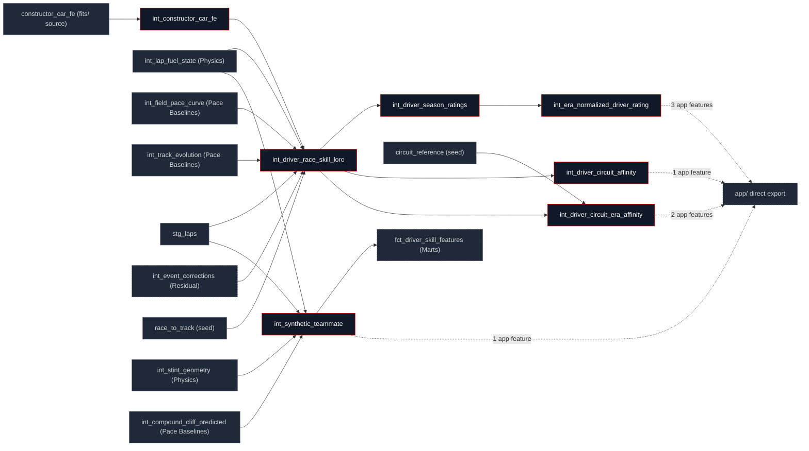

## What this family does

Skill isolates driver performance from car performance using two genuinely different identification strategies that both live in this family. The first is a four-stage rating pipeline: a de-biased constructor×race fixed effect read from an external `pyfixest` fit, a leave-one-race-out (LORO) teammate baseline built on top of it, per-cell Bayesian shrinkage at season and circuit grain, and a bridge-driver calibration across the 2022 regulation boundary. The second is `int_synthetic_teammate`, a single self-contained pairwise comparison with no shrinkage and no fixed-effects fit.

**These signals are not the seven-term identity's closure-defined `driver_skill`.** That term (`pace_delta` minus the six physics components, see [The Seven-Term Identity](/decomposition/seven-term-identity)) is computed entirely inside [Residual Decomposition](/transform/families/residual), from a different baseline. No model in this family `ref()`s anything in Residual Decomposition, and no residual model reads anything here verified directly against `manifest.json`, not assumed (see the correction note on this tab's [overview](/transform/overview)). This family's outputs are an independently-estimated, complementary rating system, built for ranking and leaderboards rather than for closing a per-lap identity.

Upstream is mostly Pace Baselines (`int_field_pace_curve`, `int_track_evolution`) and Physics (`int_lap_fuel_state`, `int_stint_geometry`), plus one external source the constructor car-pace fit lives outside `dbt run` entirely, in `data/fits/constructor_car_fe.parquet`. Downstream is asymmetric: of the seven models, only `int_synthetic_teammate` is read by any other dbt model (`fct_driver_skill_features`, the one ML feature mart this family touches). The other six are leaves in the model DAG, reachable only by their own CI tests and four of those six are exported straight to the app by `scripts/export_app_data.py`, each powering a named feature directly with no marts model in between.

## The sub-DAG



The four directly-exported models power, by name: `int_era_normalized_driver_rating` → Era Ratings Timeline, Era Translator, Hidden Performance; `int_driver_circuit_affinity` → Driver Circuit Affinity; `int_driver_circuit_era_affinity` → Ghost Race Standings, Hidden Performance; `int_synthetic_teammate` → Synthetic Teammate (in addition to its `fct_driver_skill_features` edge above) verified against the app's own query files, not inferred from the export script alone. `int_constructor_car_fe`, `int_driver_race_skill_loro`, and `int_driver_season_ratings` are pure pipeline stages: nothing reads them except the next stage and their own tests.

## How it works

The LORO baseline is the family's representative move: a driver's car baseline is the mean of his *other* same-car teammates' median pace delta, built by subtracting his own contribution out of the car's summed total rather than computing two separate baselines per car:

```sql
CASE
    WHEN ca.n_car_drivers > 1
        THEN (ca.sum_driver_median_s - dra.driver_median_pace_delta_s)
             / (ca.n_car_drivers - 1)
END AS loro_car_baseline_s
```

Three of the seven models pull an observed cell mean toward a wider prior via the same conjugate posterior, the `bayesian_shrinkage` macro:

$$\hat\mu_{\text{post}} = \frac{n \cdot \bar x_{\text{obs}} + k \cdot \mu_{\text{prior}}}{n + k}$$

where $k$ is the prior weight, expressed as virtual observations ($k=5$ everywhere in this family five virtual races or circuit-visits' worth of pull toward the prior mean).

<Steps>
  <Step title="Car FE">
    `int_constructor_car_fe` reads a two-way fixed-effects fit (`pace_delta_s ~ 1 | driver_id + constructor_race`) from an external `pyfixest` artifact: car pace net of who drove it, anchored globally so one weak driver's slowness can't leak back in as car pace.
  </Step>
  <Step title="LORO baseline">
    `int_driver_race_skill_loro` computes two parallel signals per driver-race: a leave-one-race-out teammate baseline on the 20th-percentile (ceiling) lap delta, feeding the rating chain; and a field-anchored signal median pace delta minus the car FE used only by the era-affinity model below.
  </Step>
  <Step title="Per-cell shrink">
    `int_driver_season_ratings` (season grain) and `int_driver_circuit_affinity` / `int_driver_circuit_era_affinity` (circuit and circuit×era grain) each shrink their observed cell mean toward a wider prior mean with the same conjugate macro.
  </Step>
  <Step title="Era bridge">
    `int_era_normalized_driver_rating` finds drivers with ≥8 clean races on both sides of the 2022 regulation boundary and uses their average rating shift across it as a global offset applied to every pre-2022 season.
  </Step>
</Steps>

## Design notes

<Tabs>
  <Tab title="Why this shape">
    The car-pace fixed effect lives outside `dbt run` because a two-way HDFE with high-cardinality terms (driver × constructor-race) is a real linear-algebra problem, not something a window function expresses the offline fit-and-promote shape mirrors [Reference](/transform/families/reference)'s seed-and-promote cycle for the compound-cliff coefficients.

    LORO exists because a same-car median baseline is contaminated by both drivers, including a weak one subtracting it hands the weak driver's slowness back to his teammate as "skill." LORO removes the focal driver from his own baseline; the field-anchored variant goes further, replacing the single-teammate baseline with the FE's global driver anchor specifically for the era-affinity model, which otherwise inflates a driver paired with a persistently slower teammate.

    `driver_skill_loro_s` uses the 20th-percentile (ceiling) lap delta rather than the median, on purpose: the median understates a dominant-car leader who's cruising rather than pushing. The same model also emits a median-based variant for the ghost-pace simulation, deliberately the more conservative number, because a ceiling-based estimate calibrates poorly once it's feeding a probabilistic race simulation rather than a season ranking.

    `int_driver_circuit_era_affinity` reads the `circuit_reference` seed directly rather than going through [Reference](/transform/families/reference)'s `dim_circuits`, because it needs `circuit_id_from_name`'s physical-venue resolution specifically so a renamed event or a double-header pools into one track record; `int_driver_circuit_affinity` (the non-era sibling) skips that resolution and pools by the raw event-slug `circuit_key` instead, the simpler grain being adequate since it doesn't need to bridge anything across eras.

    The bridge-driver threshold (≥8 races each side) and the `low_anchor_sample_flag` fallback (offset forced to 0 below 3 bridge drivers) exist so a thin cross-era sample never produces a confident-looking offset built on a handful of drivers.
  </Tab>
  <Tab title="Other approaches">
    A full hierarchical or mixed-effects model is the credible alternative to closed-form conjugate shrinkage at every shrink point in this family. The conjugate form is auditable in pure SQL and adequate for a Normal-Normal problem with a roughly stable within-cell variance; a mixed-effects fit would need to leave `dbt run` the way the car FE already does, for a precision gain this family's CI tolerances don't currently need.

    LORO/FE de-biasing and `int_synthetic_teammate`'s pairwise comparison are not competing designs here both shipped, deliberately, for different jobs. The pairwise comparison needs no shrinkage or fitted car term and is the one signal stable enough at single-race grain to feed an ML model; the LORO/shrinkage/era chain is tuned for a season- or career-length rating, not a per-race feature.

    A continuous era covariate (treating the regulation change as a smooth drift rather than a step) is the credible alternative to the discrete 2022 split. The discrete split is auditable per driver you can name the bridge drivers and inspect their individual shift and matches the actual regulation history being a step change at a known date; a continuous covariate would need its own functional-form assumption with no obvious physical basis.
  </Tab>
</Tabs>

## Every model in this family

<CardGroup cols={3}>
  <Card title="int_constructor_car_fe" icon="car" href="/reference/models/int/int_constructor_car_fe">
    Thin reader over an external two-way fixed-effects fit (driver × constructor-race): car pace net of who drove it.
  </Card>
  <Card title="int_driver_race_skill_loro" icon="users" href="/reference/models/int/int_driver_race_skill_loro">
    Two skill signals per driver-race: a leave-one-race-out teammate baseline for the rating chain, and a field-anchored car-FE baseline for era affinity.
  </Card>
  <Card title="int_driver_season_ratings" icon="calendar" href="/reference/models/int/int_driver_season_ratings">
    Race-grain skill shrunk to season grain via Bayesian conjugate shrinkage toward the season mean.
  </Card>
  <Card title="int_era_normalized_driver_rating" icon="shuffle" href="/reference/models/int/int_era_normalized_driver_rating">
    Cross-era comparable rating: bridge-driver calibration anchors the 2022 regulation boundary.
  </Card>
  <Card title="int_driver_circuit_affinity" icon="map-pin" href="/reference/models/int/int_driver_circuit_affinity">
    Per-(driver, circuit) shrunk affinity: how much faster or slower a driver is at one circuit relative to their own career average.
  </Card>
  <Card title="int_driver_circuit_era_affinity" icon="flag" href="/reference/models/int/int_driver_circuit_era_affinity">
    The same affinity, era-split and car-removed via the FE baseline the "equal-car track record" leaderboard signal.
  </Card>
  <Card title="int_synthetic_teammate" icon="user-check" href="/reference/models/int/int_synthetic_teammate">
    Lap-by-lap synthetic teammate comparison, tyre-state-adjusted no shrinkage, no FE, the family's only ML feature mart input.
  </Card>
</CardGroup>
