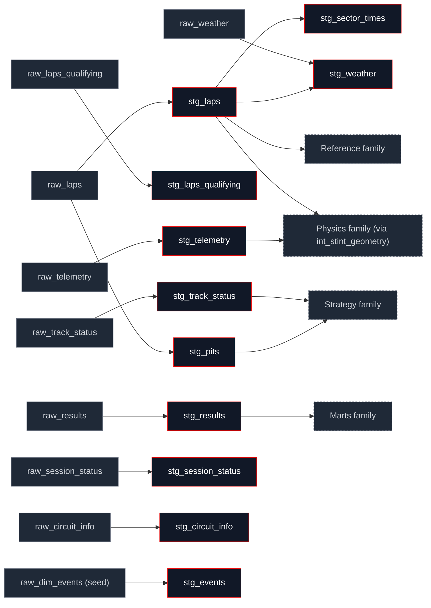

## What this family does

Staging is where the transform layer touches Bronze Parquet and nowhere else twelve views, each owning exactly one Bronze source (or, for two models, a typed-empty stub standing in for a source that isn't ingested yet). The job is narrow on purpose: rename columns to snake_case, cast FastF1's nanosecond timings to seconds, and derive a small number of per-row validity flags `is_valid_lap`, `is_safety_car_lap`, `is_pit_lap`. No model in this family aggregates across rows or applies a business rule that changes which laps count; that judgment is left to the families that read staging.

Staging's only upstream is Bronze Parquet (read via `external_location`, the same mechanism a future warehouse target would use). Its downstream is everything else `stg_laps` alone is read directly by twenty other models across every family in this tab, which makes it the busiest single table in the DAG.

## The sub-DAG



`stg_laps` is the single busiest model in the entire transform layer; the diagram collapses its non-staging consumers to one node per downstream family rather than naming all twenty, which is the family-page sub-DAG's one deliberate simplification for this page (every other family's sub-DAG names its neighbours individually). `stg_tyre_allocations`, the twelfth staging model, has no upstream edge it's a stub; see "Why this shape" below.

## How it works

The representative pattern, from `stg_laps`: rename, cast nanoseconds to seconds, derive a flag.

```sql
CASE
    WHEN laptime IS NOT NULL THEN CAST(laptime AS DOUBLE) / 1e9
END AS lap_time_s,
...
lap_time_s > 0
AND NOT is_pit_lap
AND NOT is_deleted
AND is_accurate
AND NOT REGEXP_MATCHES(track_status, '.*[4567].*')
AND lap_number > 1
    AS is_valid_lap
```

`is_valid_lap` is the gate every physics and pace-baseline model filters on it is computed once, here, so "what counts as a real lap" has exactly one definition in the whole layer.

The other recurring pattern is decoding a FastF1 enum into named flags, done once in staging rather than re-parsed by every consumer. `stg_track_status` decodes the multi-digit `TrackStatus` string:

```sql
CASE CAST(status AS VARCHAR)
    WHEN '1' THEN 'all_clear'
    WHEN '2' THEN 'yellow'
    WHEN '4' THEN 'safety_car'
    WHEN '5' THEN 'red_flag'
    WHEN '6' THEN 'vsc'
    WHEN '7' THEN 'vsc_ending'
    ELSE 'unknown'
END AS status_label
```

This decode is ground-truthed against FastF1's own `Message` column, not guessed from the digits it is the canonical mapping for every safety-car-aware model downstream (`int_sc_hazard_history` in Strategy, the `is_safety_car_lap`/`is_vsc_lap` flags `stg_laps` derives independently for its own `is_valid_lap` filter).

## Design notes

<Tabs>
  <Tab title="Why this shape">
    Staging stays a thin, mechanical rename-and-cast layer so a contributor never has to ask "did business logic creep in here." Two models bend that rule, deliberately: `stg_sector_times` unpivots one lap row into three (one per sector), and `stg_weather` ASOF-joins the nearest weather sample onto each lap's start time. Both are grain-defining transforms a sector needs its own row to be joinable, a lap needs a weather reading attached to be usable not business rules about which laps or sectors are valid. The line staging holds is "no decision about what counts," not "no joins at all."

    The TrackStatus decode lives in staging rather than downstream for the same reason `is_valid_lap` does: it is read by enough independent downstream models (the hazard history in Strategy, the validity flag in `stg_laps` itself) that decoding it twice would mean two places a digit mapping could drift apart silently.

    `stg_tyre_allocations` is a stub a typed, always-empty view standing in for a Pirelli allocation source that isn't ingested yet. Staging absorbs that source-availability gap behind a stable, correctly-typed contract, so `dim_compounds_season` can reference it without a forward-reference error; FastF1 already exposes compound labels directly on `stg_laps`, which is why this is low-priority rather than blocking.
  </Tab>
  <Tab title="Other approaches">
    A stricter reading of "staging is 1:1 with Bronze" would push the sector unpivot and the weather ASOF join into the intermediate layer instead, keeping every staging model a pure per-row rename. The cost: both transforms have exactly one consumer pattern each (sector-grain joins, weather-at-lap-start joins), so pushing them downstream would mean every consumer re-derives the same join rather than reading a pre-joined view once.

    Decoding `TrackStatus` per-consumer instead of once in `stg_track_status` would avoid staging owning a piece of derived classification logic but would multiply the place a FastF1 status-code mapping could be transcribed incorrectly from one to several, exactly the kind of drift the single ground-truthed decode in this family prevents.
  </Tab>
</Tabs>

## Every model in this family

<CardGroup cols={3}>
  <Card title="stg_laps" icon="table" href="/reference/models/stg/stg_laps">
    Cleaned race-lap data: rename, nanosecond casts, the validity and track-status flags everything downstream filters on.
  </Card>
  <Card title="stg_laps_qualifying" icon="table" href="/reference/models/stg/stg_laps_qualifying">
    The same rename/cast/validity pattern as stg_laps, for Q1/Q2/Q3 sessions.
  </Card>
  <Card title="stg_telemetry" icon="table" href="/reference/models/stg/stg_telemetry">
    10 Hz car telemetry, renamed and projected to the powertrain channels the physics family consumes.
  </Card>
  <Card title="stg_sector_times" icon="table" href="/reference/models/stg/stg_sector_times">
    Per-sector timing unpivoted from stg_laps: one row per lap × sector.
  </Card>
  <Card title="stg_pits" icon="table" href="/reference/models/stg/stg_pits">
    Pit-stop events derived from non-null pit-in/pit-out timestamps on stg_laps.
  </Card>
  <Card title="stg_weather" icon="table" href="/reference/models/stg/stg_weather">
    Weather snapshot ASOF-joined to each lap's start time.
  </Card>
  <Card title="stg_events" icon="table" href="/reference/models/stg/stg_events">
    Race-level events (damage, retirements, penalties) from a manually maintained seed.
  </Card>
  <Card title="stg_results" icon="table" href="/reference/models/stg/stg_results">
    Classified race results: finishing position, grid, points, an explicit DNF split.
  </Card>
  <Card title="stg_track_status" icon="table" href="/reference/models/stg/stg_track_status">
    The SC/VSC/yellow/red timeline, decoded once and ground-truthed against FastF1's own message text.
  </Card>
  <Card title="stg_session_status" icon="table" href="/reference/models/stg/stg_session_status">
    Session lifecycle events; 'Aborted' surfaces as the red-flag-stop flag.
  </Card>
  <Card title="stg_circuit_info" icon="table" href="/reference/models/stg/stg_circuit_info">
    Corner geometry per circuit per season, ordered by distance along the lap.
  </Card>
  <Card title="stg_tyre_allocations" icon="table" href="/reference/models/stg/stg_tyre_allocations">
    Stub: a typed empty view standing in for a Pirelli allocation source not yet ingested.
  </Card>
</CardGroup>
