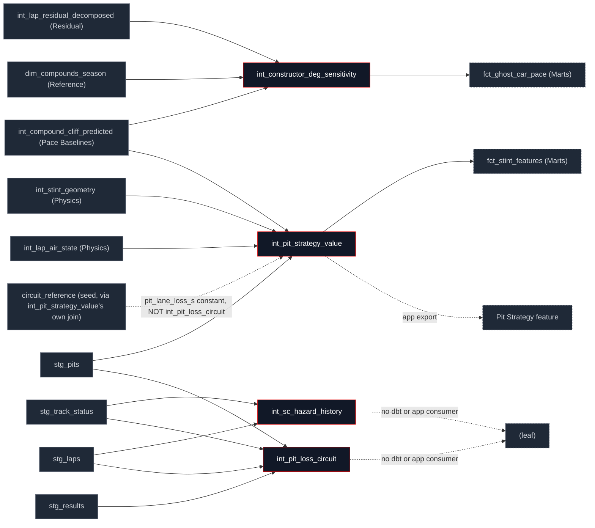

## What this family does

Strategy answers decision-support questions the rest of the pipeline doesn't: was a pit stop early, late, or undercut-forced; how often does a given circuit see a Safety Car per racing lap; and which constructors degrade their tyres faster or hit the cliff later than the field. All four models are counterfactual or base-rate estimates built on top of earlier families, not new physics terms none of them feeds back into the residual identity.

Upstream spans three families: Pace Baselines (`int_compound_cliff_predicted`, the cliff model every strategy counterfactual assumes is correct), Residual Decomposition (`int_lap_residual_decomposed`, for the deg-sensitivity slope), and Staging directly (`stg_track_status`, `stg_results`, `stg_pits`, `stg_laps` for the two circuit base-rate models, which don't need any physics decomposition first). Downstream is thin and uneven: only two of the four models are read by anything else in dbt at all.

## The sub-DAG



**A genuine schema/SQL mismatch found here, not assumed**: `int_pit_loss_circuit`'s own description says it exists "to replace the largely-imputed constant... used by `int_pit_strategy_value`" and even claims to be "consumed by `int_pit_strategy_value`" but `manifest.json` shows no `ref()` from `int_pit_strategy_value` to `int_pit_loss_circuit` at all. Reading `int_pit_strategy_value.sql` directly confirms it: the pit-lane-loss join still goes straight to `circuit_reference.pit_lane_loss_s` (the seed constant, defaulting to 21.0 s for missing circuits), not to this model's empirically-fitted, EB-shrunk value. `int_pit_loss_circuit` and `int_sc_hazard_history` are both, today, leaves in the model DAG built, tested by their own singular tests, but read by nothing else in dbt and exported to no app feature (verified by grepping every `app/src/features/*/queries.ts`). This page states the verified current wiring, not the aspirational one in the model's own description; flagging the description text for the same Part 8 sweep Part 3 and Part 4 already flagged similar overclaims for.

## How it works

The constructor degradation slope is a within-stint fixed-effects regression, expressed in closed form rather than fit with a library a single OLS slope per (constructor, compound, season) cell, computed directly from sums:

```sql
slope_raw = SUM((age - mean_age_stint) * (resid - mean_resid_stint))
          / SUM((age - mean_age_stint)^2)
```

The raw slope is uniformly negative across every constructor (residual fuel under-correction leaking through the decomposition), so the model field-centres each cell against the precision-weighted per-(compound, season) mean before anything downstream consumes it only the centred deviation, not the raw slope, is the production value.

The two circuit base-rate models (SC hazard, pit loss) share one empirical-Bayes shrinkage shape a pseudo-count blend toward a global pooled rate, distinct from the DerSimonian-Laird random-effects shrink the degradation slope uses above:

```sql
(c.n_sc_onsets + g.sc_rate * {{ var('sc_hazard_prior_laps', 600) }})
/ (c.racing_laps + {{ var('sc_hazard_prior_laps', 600) }})
    AS sc_hazard_per_lap_shrunk
```

600 laps of prior weight (roughly a handful of races) keeps a circuit with one or two race-years of history from reading a hazard of exactly 0 or an extreme outlier; `int_pit_loss_circuit` does the same blend with a 15-stop prior instead of a lap-count prior, since its unit of exposure is pit stops, not laps.

Strategy verdicts on pit timing are a plain ordered `CASE`, not a regression a stop within one lap of the modelled optimum is `'optimal'`; later is `'overran'`; earlier counts as `'undercut_forced'` only if a rival's predicted gap closed below the pit-loss threshold within two laps of the actual stop, otherwise it's `'early'`:

```sql
WHEN ABS(ap.actual_pit_lap - occ.optimal_pit_lap_number) <= 1 THEN 'optimal'
WHEN ap.actual_pit_lap > occ.optimal_pit_lap_number + 1 THEN 'overran'
WHEN ap.actual_pit_lap < occ.optimal_pit_lap_number - 1
     AND mgps.first_undercut_threat_lap IS NOT NULL
     AND ap.actual_pit_lap >= mgps.first_undercut_threat_lap - 2
     THEN 'undercut_forced'
```

## Design notes

<Tabs>
  <Tab title="Why this shape">
    The optimal-pit-lap counterfactual leans entirely on the cliff model (`int_compound_cliff_predicted`) being correct it isn't fit independently from race outcomes, it's a deterministic minimisation over the cliff model's predicted degradation cost across a fixed window around the modelled onset. That's a stated assumption in the model's own header, not hidden: the strategy verdict is only as good as the cliff prediction it's built on, and a circuit or compound where the cliff model is weak will produce a strategy verdict with the same weakness.

    Two different empirical-Bayes shrinkage shapes coexist in this family for a reason, not by accident: the circuit base-rate models (SC hazard, pit loss) shrink a *rate* toward a global pooled rate with a pseudo-count prior, the natural conjugate form for a count-over-exposure problem. The degradation slope shrinks a *deviation* (already field-centred, so its prior mean is exactly 0 by construction) using a DerSimonian-Laird between-group variance estimate, the standard random-effects meta-analysis form, appropriate because the thing being pooled across constructors is itself a fitted estimate with its own standard error, not a raw count.

    `int_sc_hazard_history` and `int_pit_loss_circuit` exist as base-rate building blocks even though nothing downstream reads them yet today: a per-lap hazard estimate and an empirical (rather than imputed) pit-loss prior are exactly the two inputs a lap-by-lap race simulation would need to draw a Safety Car or model pit-loss uncertainty, neither of which the deterministic `int_pit_strategy_value` counterfactual currently does.
  </Tab>
  <Tab title="Other approaches">
    Wiring `int_pit_loss_circuit`'s empirical, EB-shrunk pit-loss value into `int_pit_strategy_value` in place of the flat `circuit_reference` seed constant is the credible next step the model's own description already names as its purpose it would tighten the opportunity-cost estimate for circuits whose real pit-lane loss diverges from the imputed 21 s default, at the cost of one more join and one more place precision can be lost for thin-data circuits.

    A fitted hazard model (logistic or Cox, conditioning on lap number, weather, and grid spread) is the credible alternative to `int_sc_hazard_history`'s flat per-circuit empirical rate it would let a simulation vary the SC probability within a race instead of treating every lap at a venue as equally hazardous, at the cost of needing more than the circuit-level grain this model currently estimates at.

    A stochastic strategy model (Monte Carlo over pit-loss and degradation uncertainty, rather than a single deterministic optimum) is the credible alternative to today's point-estimate verdict the deterministic minimisation is auditable and matches the rest of the family's "named assumption, no hidden randomness" style; a stochastic version would need the two currently-unconsumed base-rate models as direct inputs.
  </Tab>
</Tabs>

## Every model in this family

<CardGroup cols={3}>
  <Card title="int_constructor_deg_sensitivity" icon="trending-up" href="/reference/models/int/int_constructor_deg_sensitivity">
    Within-stint FE slope of degradation per (constructor, compound, season), field-centred and EB-shrunk feeds the ghost-car host-identity interaction term.
  </Card>
  <Card title="int_pit_strategy_value" icon="fuel" href="/reference/models/int/int_pit_strategy_value">
    Counterfactual optimal pit lap and opportunity cost per stint, plus an undercut-threat lap and an optimal/overran/undercut_forced/early verdict.
  </Card>
  <Card title="int_sc_hazard_history" icon="triangle-alert" href="/reference/models/int/int_sc_hazard_history">
    Per-circuit Safety Car / VSC hazard rate per racing lap, EB-shrunk toward the global pooled rate. Currently a leaf no dbt or app consumer yet.
  </Card>
  <Card title="int_pit_loss_circuit" icon="circle-parking" href="/reference/models/int/int_pit_loss_circuit">
    Empirical per-circuit pit-lane loss from real in-lap/out-lap deltas, EB-shrunk. Not yet wired into int_pit_strategy_value despite its stated purpose.
  </Card>
</CardGroup>
