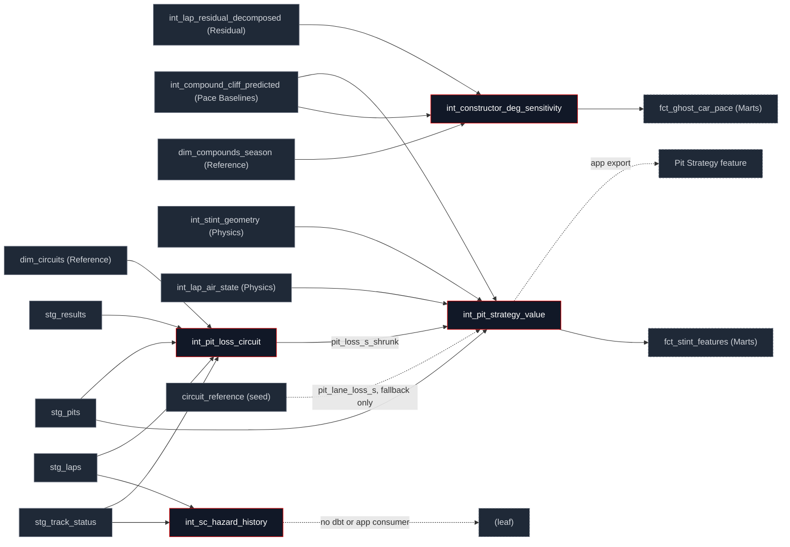

## What this family does

Strategy answers decision-support questions the rest of the pipeline doesn't: was a pit stop early, late, or undercut-forced; how often does a given circuit see a Safety Car per racing lap; and which constructors degrade their tyres faster or hit the cliff later than the field. All four models are counterfactual or base-rate estimates built on top of earlier families, not new physics terms none of them feeds back into the residual identity.

Upstream spans three families: Pace Baselines (`int_compound_cliff_predicted`, the cliff model every strategy counterfactual assumes is correct), Residual Decomposition (`int_lap_residual_decomposed`, for the deg-sensitivity slope), and Staging directly (`stg_track_status`, `stg_results`, `stg_pits`, `stg_laps` for the two circuit base-rate models, which don't need any physics decomposition first). Downstream is thin and uneven: only two of the four models are read by anything else in dbt at all.

## The sub-DAG



**The mismatch this page used to record is now closed.** `int_pit_loss_circuit`'s description said it existed "to replace the largely-imputed constant... used by `int_pit_strategy_value`", but for as long as both models existed no `ref()` connected them and the pit-lane-loss join went straight to `circuit_reference.pit_lane_loss_s`. `int_pit_strategy_value` now reads `pit_loss_s_shrunk` and falls back to the seed only for a circuit that resolves no clean stops — one race in seven seasons, 2018 round 14, whose `race_to_track` row has a NULL `track_id`. A `pit_loss_source` column on every stint records which of the two was used. `int_sc_hazard_history` remains a genuine leaf: built, tested by its own singular test, read by nothing else in dbt and exported to no app feature.

## How it works

The constructor degradation slope is a within-stint fixed-effects regression, expressed in closed form rather than fit with a library a single OLS slope per (constructor, compound, season) cell, computed directly from sums:

```sql
slope_raw = SUM((age - mean_age_stint) * (resid - mean_resid_stint))
          / SUM((age - mean_age_stint)^2)
```

The raw slope is uniformly negative across every constructor (residual fuel under-correction leaking through the decomposition), so the model field-centres each cell against the precision-weighted per-(compound, season) mean before anything downstream consumes it only the centred deviation, not the raw slope, is the production value.

The two circuit base-rate models (SC hazard, pit loss) share one empirical-Bayes shrinkage shape a pseudo-count blend toward a global pooled rate, distinct from the DerSimonian-Laird random-effects shrink the degradation slope uses above:

```sql
(c.n_sc_onsets + g.sc_rate * {{ var('sc_hazard_prior_laps', 600) }})
/ (c.racing_laps + {{ var('sc_hazard_prior_laps', 600) }})
    AS sc_hazard_per_lap_shrunk
```

600 laps of prior weight (roughly a handful of races) keeps a circuit with one or two race-years of history from reading a hazard of exactly 0 or an extreme outlier; `int_pit_loss_circuit` does the same blend with a 15-stop prior instead of a lap-count prior, since its unit of exposure is pit stops, not laps.

The optimum itself is an argmin, not a rule of thumb. `int_pit_strategy_cost_curve` prices every candidate pit lap in the horizon and `int_pit_strategy_value` takes the minimum:

```sql
Total_Cost(L) = old_wear_cost_s      -- L laps on the set you are on
              + new_wear_cost_s      -- the rest of the horizon on the next set
              + baseline_cost_s      -- per-lap pace offset between the compounds
              + pit_lane_loss_s * pit_discount_factor
```

`L = H` is the no-stop candidate and pays no pit term, which is what makes a stop justify itself. The discount is the part that matters:

```sql
pit_discount(L) = 1 - (1 - m) * (1 - (1 - h)^L)
```

Under a fixed one-stop the pit-lane loss is the same whenever you take it, so it adds a constant to every candidate and drops out of the argmin entirely — a longer pit lane would move nothing. Discounting it by the chance a caution has already appeared (`h` from `int_sc_hazard_history`, `m` the SC cost multiplier) is what makes waiting pay, and it is why a longer pit lane pushes the optimum later. `assert_pit_loss_pushes_optimum_later` re-minimises the same curve at a pit lane 15 s longer and fails if the answer retreats.

Strategy verdicts on pit timing are then a plain ordered `CASE`, not a regression a stop within one lap of the modelled optimum is `'optimal'`; later is `'overran'`; earlier counts as `'undercut_forced'` only if the stop landed inside the window where the undercut threat opened, otherwise it's `'early'`:

```sql
WHEN ABS(r.actual_offset - r.pick_offset) <= 1 THEN 'optimal'
WHEN r.actual_offset > r.pick_offset + 1 THEN 'overran'
WHEN r.first_undercut_threat_lap IS NOT NULL
     AND r.actual_pit_lap BETWEEN r.first_undercut_threat_lap - 2
                              AND r.first_undercut_threat_lap + 3
     THEN 'undercut_forced'
```

Laps are compared as offsets in valid laps rather than lap numbers, so an invalid lap before the stop cannot skew the comparison.

## Design notes

<Tabs>
  <Tab title="Why this shape">
    The optimal-pit-lap counterfactual leans entirely on the cliff model (`int_compound_cliff_predicted`) being correct it isn't fit independently from race outcomes, it's a deterministic minimisation over the cliff model's predicted degradation cost across a fixed window around the modelled onset. That's a stated assumption in the model's own header, not hidden: the strategy verdict is only as good as the cliff prediction it's built on, and a circuit or compound where the cliff model is weak will produce a strategy verdict with the same weakness.

    Two different empirical-Bayes shrinkage shapes coexist in this family for a reason, not by accident: the circuit base-rate models (SC hazard, pit loss) shrink a *rate* toward a global pooled rate with a pseudo-count prior, the natural conjugate form for a count-over-exposure problem. The degradation slope shrinks a *deviation* (already field-centred, so its prior mean is exactly 0 by construction) using a DerSimonian-Laird between-group variance estimate, the standard random-effects meta-analysis form, appropriate because the thing being pooled across constructors is itself a fitted estimate with its own standard error, not a raw count.

    Both circuit base-rate models are now consumed by the optimum itself, not just displayed next to it. `int_pit_loss_circuit` sets the size of the pit term and `int_sc_hazard_history` sets how fast that term decays with waiting — the two together are what give the search a pit-loss gradient at all. Until 2026-08-23 neither reached the search: it approximated the argmin as "first lap in the cliff window where expected wear exceeds 0.5 s", a threshold with no pit-loss term in it, which returned `'optimal'` on 8 stints of 7,129 and `'unknown'` on 2,231 — more than half of every stint that ended in a stop. The argmin returns 715 and 266.

    Two horizons are reported because they answer different questions. The verdict follows the **two-stint window** — this stint's first lap through the next stint's last — which grades the stop inside the strategy the team actually ran. That is the only framing well posed for the 61% of stints belonging to a 2-stop or longer race; a race-remainder one-stop counterfactual scores every 2-stopper's first stint as `'early'` for a reason that has nothing to do with the stint. The race-remainder optimum is carried alongside as `optimal_pit_lap_race`, asking the harsher unconditional question.
  </Tab>
  <Tab title="Other approaches">
    Letting the compound *pace* offset move the optimum is the open judgement call, exposed as `pit_strategy_baseline_delta`. `baseline_cost_s` carries the per-lap difference between the old and new compound, built from `compound_grip_peak` and the optimal-temperature bounds — and both of those are per-compound **constants** in `compound_cliff_params`, one distinct value each across all 403 seed rows, never fitted. As typed, `grip_peak` prices SOFT (1.03) slower than HARD (0.97). Over a 20-lap arm that is roughly 1.2 s of unmeasured offset pushing against fitted wear effects of the same magnitude. The var is `true` today; setting it `false` drops the term and leaves the argmin to fitted wear, cliff onset and severity alone. Fitting a real per-compound pace baseline is the change that would settle it.

    A fixed number of stops is the other standing simplification: the cost function prices exactly one stop inside its horizon. Choosing the *number* of stops needs a different search — over strategies rather than over laps — and is what a full race simulation would add.

    A fitted hazard model (logistic or Cox, conditioning on lap number, weather, and grid spread) is the credible alternative to `int_sc_hazard_history`'s flat per-circuit empirical rate it would let a simulation vary the SC probability within a race instead of treating every lap at a venue as equally hazardous, at the cost of needing more than the circuit-level grain this model currently estimates at.

    A stochastic strategy model (Monte Carlo over pit-loss and degradation uncertainty, rather than a single deterministic optimum) is the credible alternative to today's point-estimate verdict the deterministic minimisation is auditable and matches the rest of the family's "named assumption, no hidden randomness" style; a stochastic version would need the two currently-unconsumed base-rate models as direct inputs.
  </Tab>
</Tabs>

## Every model in this family

<CardGroup cols={3}>
  <Card title="int_constructor_deg_sensitivity" icon="trending-up" href="/reference/models/int/int_constructor_deg_sensitivity">
    Within-stint FE slope of degradation per (constructor, compound, season), field-centred and EB-shrunk feeds the ghost-car host-identity interaction term.
  </Card>
  <Card title="int_pit_strategy_value" icon="fuel" href="/reference/models/int/int_pit_strategy_value">
    Counterfactual optimal pit lap and opportunity cost per stint, plus an undercut-threat lap and an optimal/overran/undercut_forced/early verdict.
  </Card>
  <Card title="int_sc_hazard_history" icon="triangle-alert" href="/reference/models/int/int_sc_hazard_history">
    Per-circuit Safety Car / VSC hazard rate per racing lap, EB-shrunk toward the global pooled rate. Currently a leaf no dbt or app consumer yet.
  </Card>
  <Card title="int_pit_loss_circuit" icon="circle-parking" href="/reference/models/int/int_pit_loss_circuit">
    Empirical per-circuit pit-lane loss from real green-flag in-lap/out-lap deltas, pooled per physical venue and EB-shrunk. Read by int_pit_strategy_value.
  </Card>
</CardGroup>
