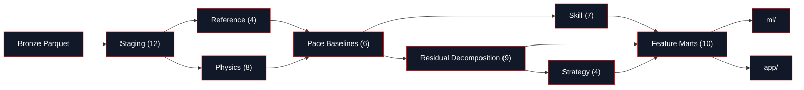

import TransformInventory from '/snippets/transform-inventory.mdx';

dbt models turn raw lap times into seven physics-attributed seconds and a driver-skill residual, in one topological pass from Bronze Parquet to feature mart. Every model is a single `SELECT` statement; dbt resolves the `{{ ref() }}` graph and runs models in dependency order, so no contributor manages `CREATE`/`DROP` sequencing by hand. This page orients you to that DAG end to end: what each tier materializes and why, the three knobs that retune the whole layer, and a map of the eight model families the rest of this tab is organised around.

<Note>
  **For a reviewer:**
  - **Decision:** a medallion warehouse (staging → intermediate → marts) where every model is a single, tested `SELECT` and lineage is resolved by dbt, not by hand.
  - **Trade-off:** pushing all business logic into SQL means a large model graph (60 models) to keep coherent and documented.
  - **Proof:** the seven-term additive identity closes to zero on every lap in CI, and 443 tests gate every build.
</Note>

This is the simplified, top-level view: it shows which family a family reads from, not every individual `ref()`. Skill and Residual Decomposition are parallel branches that both read Pace Baselines neither depends on the other and reconverge only at Feature Marts. Every model's own page (under Model Reference) carries its exact upstream and downstream lineage.

<Note>
  **`driver_skill` is a closure, not an estimate.** It is defined as `pace_delta − Σ(six physics terms)`, computed in [Residual Decomposition](/transform/families/residual). The identity is seven-term: `track_unexplained_s`, surfaced on some models, is informational and is not part of the closure see [the Seven-Term Identity](/decomposition/seven-term-identity).
</Note>

## Eight families, one DAG

Reading order down this tab's sidebar follows the DAG's topological order staging, then reference, then the five intermediate families, then marts so walking the tab top to bottom walks the data the same direction it flows.

<CardGroup cols={2}>
  <Card title="Staging" icon="layers" href="/transform/families/staging">
    Rename Bronze to snake_case, cast nanoseconds to seconds, derive validity flags. No joins, no aggregation.
  </Card>
  <Card title="Reference" icon="library" href="/transform/families/reference">
    Seed-backed dimensions: per-circuit physics constants, per-(circuit, compound, season) cliff coefficients, stable IDs.
  </Card>
  <Card title="Physics" icon="atom" href="/transform/families/physics">
    Deterministic and EMA physics state per lap: fuel mass, thermal load, air state, corner g, telemetry cliff signals.
  </Card>
  <Card title="Pace Baselines" icon="gauge" href="/transform/families/pace-baselines">
    The reference surfaces every lap is measured against: trimmed field median, rubber/ambient split, compound trajectory, constructor structural pace.
  </Card>
  <Card title="Skill" icon="award" href="/transform/families/skill">
    De-bias car from driver and shrink the residual: fixed effects, leave-one-race-out, normal-normal conjugate shrinkage, era bridges.
  </Card>
  <Card title="Residual Decomposition" icon="sigma" href="/transform/families/residual">
    Where the identity closes: subtract the physics terms, and what remains is skill plus the hygiene that keeps the residual honest.
  </Card>
  <Card title="Strategy" icon="route" href="/transform/families/strategy">
    Counterfactual strategy value: pit-loss by circuit, per-constructor degradation sensitivity, safety-car hazard rates.
  </Card>
  <Card title="Feature Marts" icon="package" href="/transform/families/marts">
    The gold layer: the contract with `ml/` and `app/`.
  </Card>
</CardGroup>

## How the layer is built

Off The Pace runs dbt Core against DuckDB everywhere the same project runs locally (the `dev` target) and in CI (the `ci` target), both file-based DuckDB databases, so there's no environment-specific behaviour to account for. Sources are read via `external_location` against the Bronze Parquet tree, the same mechanism a future Microsoft Fabric Lakehouse target would use; that target is the planned production-scale successor and isn't wired in yet.

Materialization is set per directory in `dbt_project.yml`, not per model:

<Tabs>
  <Tab title="Views staging, intermediate">
    Staging (12 models) and the five intermediate families (34 models) materialize as DuckDB **views**: zero storage, recomputed on every query, and always reflect the latest upstream data. A 34-model intermediate chain is exactly the case where materializing every stage as a table would multiply storage for data that only the next model in the chain ever reads a view costs nothing until something queries through it.
  </Tab>
  <Tab title="Tables reference, marts">
    Reference (4 dimensions) and marts (10 models) materialize as DuckDB **tables**: computed once per `dbt run`, then read directly. Reference is seed-backed and changes only when a seed or fitted coefficient is promoted, so there's no reason to recompute it on every query. Marts are read by every downstream consumer `ml/`, `app/`, and ad hoc analysis so precomputing once is faster than every consumer re-deriving the same 34-model chain.
  </Tab>
</Tabs>

## Tuning knobs

Three `vars` in `dbt_project.yml` retune the layer without touching SQL. Each is a single source of truth moving it changes every model that reads it on the next `dbt run`.

<AccordionGroup>
  <Accordion title="era_boundary (2022)">
    The regulation-era boundary year, set where F1's ground-effect regulations took over. Moving this single knob re-splits pre/post eras across every era-aware model and the isotonic fit behind it [`int_era_normalized_driver_rating`](/reference/models/int/int_era_normalized_driver_rating) and [`int_driver_circuit_era_affinity`](/reference/models/int/int_driver_circuit_era_affinity) in the Skill family. A third era (for example, a 2026 regulation reset) needs new label strings in `int_driver_circuit_era_affinity.sql`, not just a new boundary year.
  </Accordion>
  <Accordion title="ghost_short_run_threshold (0.5)">
    A driver who completes less of the race distance than this fraction is flagged `is_short_run` (DNF or a partial race) rather than trusted as a full pace estimate. This feeds [`fct_ghost_race_finish`](/reference/models/fct/fct_ghost_race_finish) in Feature Marts, where the ghost-car counterfactual recombination needs to know which drivers' full-race pace is trustworthy.
  </Accordion>
  <Accordion title="outlier_exclude_ratio (1.40)">
    In [`int_event_corrections`](/reference/models/int/int_event_corrections) (Residual Decomposition), a lap slower than this ratio of the race's fastest lap is hard-excluded (correction weight `0.0`). The band from `1.20` up to this ratio is soft-downweighted to `0.6` instead, salvaging legitimate heavy-fuel or traffic-affected laps rather than discarding them outright. Because every residual and mart model reads `int_event_corrections`' correction weight, this knob's effect propagates through the entire downstream DAG.
  </Accordion>
</AccordionGroup>

## By the numbers

<TransformInventory />

## Next

<CardGroup cols={4}>
  <Card title="How the Layer Works" icon="workflow" href="/transform/families/staging">
    The eight family narratives, in DAG order.
  </Card>
  <Card title="Model Reference" icon="database" href="/reference/models/stg/stg_laps">
    Every model, individually documented.
  </Card>
  <Card title="The CI Contract" icon="shield-check" href="/transform/ci/overview">
    How ~443 tests keep the DAG honest.
  </Card>
  <Card title="Macros" icon="code" href="/transform/macros">
    The seven reusable building blocks.
  </Card>
</CardGroup>
